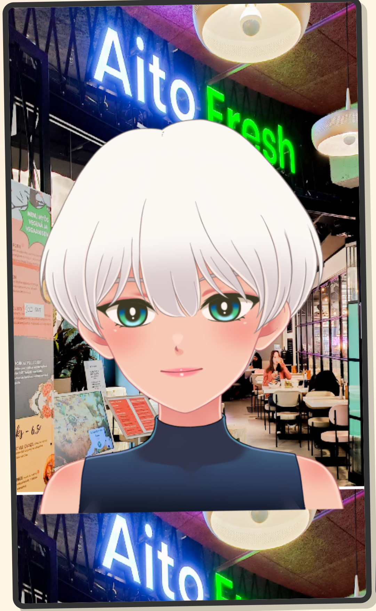
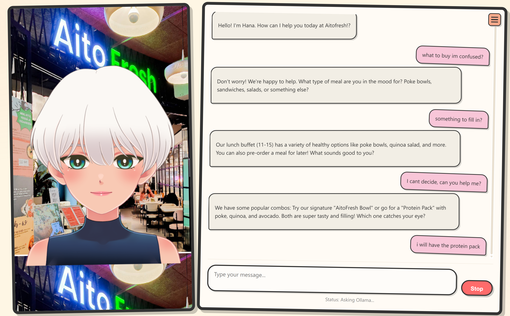

<div align="center">
  
# VirAI 🌸

<div align="center">
  
</div>


**An interactive UI for interacting with Hana - a lively 2D anime character, to order food and have lively discussions.**

[//]: # ([![GitHub stars]&#40;https://img.shields.io/github/stars/Ashish-Patnaik/VirAI?style=social&#41;]&#40;https://github.com/Ashish-Patnaik/VirAI&#41;)
[](https://www.live2d.com/)
[](https://ollama.ai/)


• [Features](#features) 
• [Installation](#installation) 
• [Usage](#usage) 
• [Screenshots](#screenshots) 
• [Configuration](#configuration) 
• [Contributing](#contributing)

</div>

## 🌟 Features

- **Speech to text**: Talk with Ollama's powerful language models in a friendly web UI and microphones
- **Live 2D Animation**: Chat with Hana, an expressive anime character that responds to your interactions
- **Know the expression of the avatar**: Display mathematical equations properly with KaTeX
- **Customizable Settings**: Choose your Ollama model and configure system prompts
- **Responsive Design**: Enjoy VirAI on desktop and mobile devices
- **Real-time Response**: Stream responses as they're generated


## 📸 Screenshots

<div align="center">
  
</div> 

[//]: # (## 💻Demo)

[//]: # (**This is just a skeleton demo**)

[//]: # (Link = https://VirAI.vercel.app/)


[//]: # (https://github.com/user-attachments/assets/2647e1e5-4636-4594-9145-253ab665d618)


## 🚀 Installation

### Prerequisites

- Python 3.8+ installed
- [Ollama](https://ollama.ai/) installed and running on your system
- Git

### Step 1: Clone the repository

```bash
git clone https://github.com/Ashish-Patnaik/VirAI.git
cd VirAI
```
### Step 2: Install dependencies
```bash
pip install -r requirements.txt
```

### Step 3: Enable Ollama CORS
```bash
OLLAMA_ORIGINS="*" ollama serve
```

### Step 4: Start the Flask server
```bash
python server.py
```
The server will start running at http://localhost:5000 by default.

### Step 5: Access VirAI in your browser
Use 
```python -m http.server 8000``` to serve the front end of the application on your browser.

### 💬 Usage

1. **Start interacting:** Press the microphone button on the website to record your voice
2. **Change Settings:** Click the hamburger menu (☰) to access settings
3. **Configure Ollama:**

  - Set your Ollama server URL (default: http://localhost:11434)
  - Choose your preferred model (e.g., llama3:8b, codellama:7b, mistral:latest)
  - Customize the system prompt for specialized responses

4. **Stop Generation:** Click the Stop button anytime to halt response generation


## 💃Models

1. **Only support Cubism 4 models**

2. **Models need to support motionsync3**

   Reference: https://docs.live2d.com/en/cubism-editor-manual/motion-sync/
   
4. **Add your models in model directory**

## ⚙️ Configuration
### Ollama Models
VirAI works with any model available in your Ollama installation. Some recommended models:

- ```llama3:8b``` - Great general purpose assistant (default)
- ```codellama:7b``` - Specialized for coding tasks
- ```mistral:latest``` - Alternative high-quality model
- ```phi3:latest``` - Microsoft's compact but powerful model

## 📖 System Prompts
These sample prompts demonstrate how the system can be customized to create engaging, human-like conversations with customers:

1. **Ordering Lunch** - "Help the customer order lunch from the menu based on the current time of day. Highlight any benefits, offers, or discounts so that the customer feels excited and happy about their choice."

2. **Booking a Table** - "Assist the customer in booking a table. Ask in a cheerful, natural way (not robotic) about when they would like to come, how many people will be joining, and if they already have dishes in mind. The interaction should feel like a friendly conversation with a human host."

3. **Exploring the Menu** - "Guide an indecisive customer through the menu without overwhelming them. Simplify the choices by suggesting options based on the time of day and the current mood of the environment in Helsinki. Keep the tone warm and human-like, creating a sense of comfort and safety when they interact with our avatar."

## 🔧 Project Structure
```
HanaVerse/
├── server.py              # Main Flask server for Ollama API requests
├── stt_ollama.py          # Speech-to-Text server using Whisper
├── stt_simple.py          # Mock STT server for testing
├── index.html             # Main web interface
├── style.css              # CSS styling for the UI
├── script.js              # Core Live2D character functionality
├── chat.js                # Chat interaction logic
├── voice.js               # Voice recording and STT integration
├── sdk/                   # Live2D SDK components
│   ├── live2d.min.js      # Live2D display library
│   └── live2dcubismcore.min.js # Live2D core engine
├── prism/                 # Syntax highlighting library
│   ├── prism.js
│   └── prism.css
├── katex/                 # Math rendering library
│   ├── katex.min.js
│   └── katex.min.css
├── models/                # Live2D model files for Hana
└── requirements.txt       # Python dependencies
```

### 🤝 Contributing
Contributions are welcome! Please feel free to submit a Pull Request.

1. **Fork the repository**
2. Create your feature branch (```git checkout -b feature/amazing-feature```)
3. Commit your changes (```git commit -m 'Add some amazing feature'```)
4. Push to the branch (```git push origin feature/amazing-feature```)
5. Open a Pull Request

### 📜 License
This project is licensed under a Custom Non-Commercial Use License.  
You may use, copy, and run this software for personal or educational use only.  
**Commercial use and modification for commercial purposes are not allowed for now.**

### 🙏 Acknowledgements

1. Whisper for the speech to text transcription
2. Ollama for the local LLM runtime
2. Live2D for the Cubism SDK
3. pixi-live2d-display for the WebGL rendering
4. Prism for syntax highlighting
5. Live2d motionsync library


<div align="center">
Made with ♥️ by Team VirAI <br />
Thanks to Ashish Patnaik for the base code
</div>

<div align="center">
Don't Forget to ⭐Star⭐ the repo
</div>
